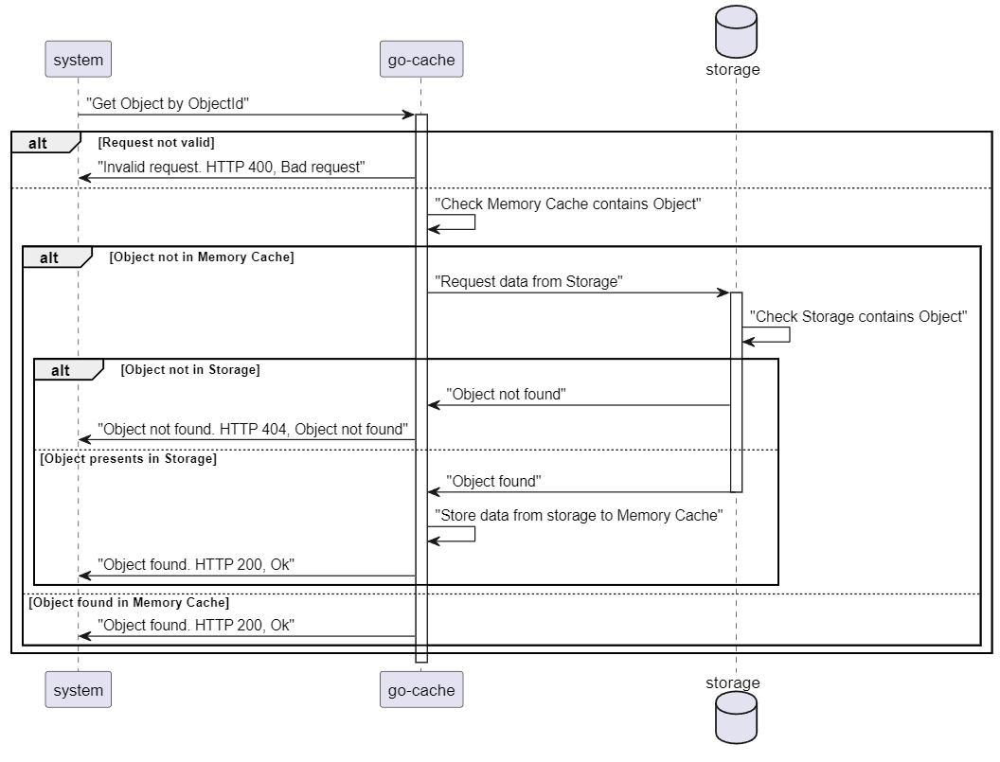
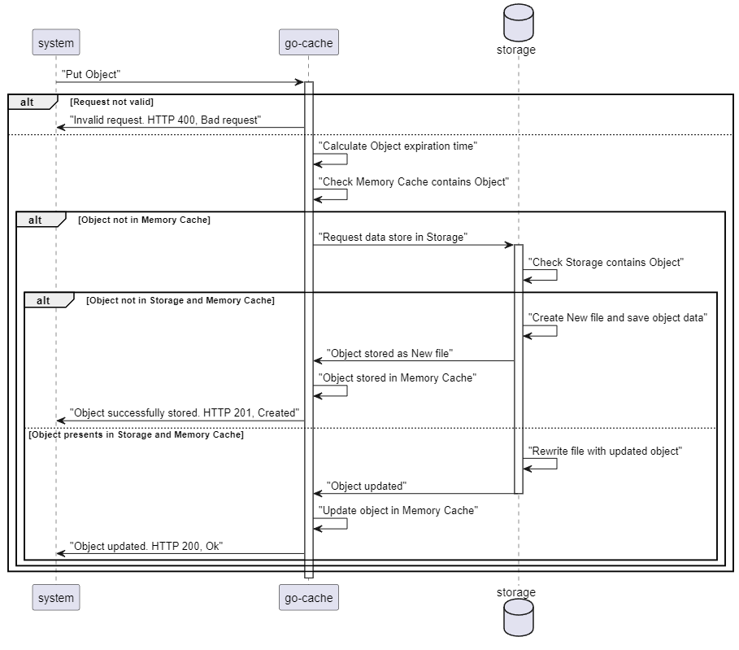

## Architecture

### UML sequence diagram

#### Get Object by Object Id

#### Put Object by Object Id

### Startup behavior

During service start it registers:

1. health and readiness endpoints
2. memory cache map
3. disk storage client

After the endpoint Registration, service set Global State to "STARTED", and readiness status code to 503 'Service unavailable'. After that starts data transfer from dist to memory cache.

If cache data storage doesn't contains any files, it set Global State to "DONE" and readiness status code to 200 Ok

If cache data storage contains any files, It set Global State to "IN_PROGRESS" and readiness status code to 503 'Service Unavailable'. Next, starts data concurrency reading from each of file and storing to Memory Cache. After completion, set Global State to "DONE" and readiness status code to 200 Ok.

### Expired Data removal behavior

After the service starts, it run the Expired Data cleanup service. It works as a channel of ticker. By default, ticket count every 10 seconds (this number based on read/write count and amount of data in memory cache) and compare expiration date of each object. If expiration date less then current tick, it removes data from storage and memory cache.
